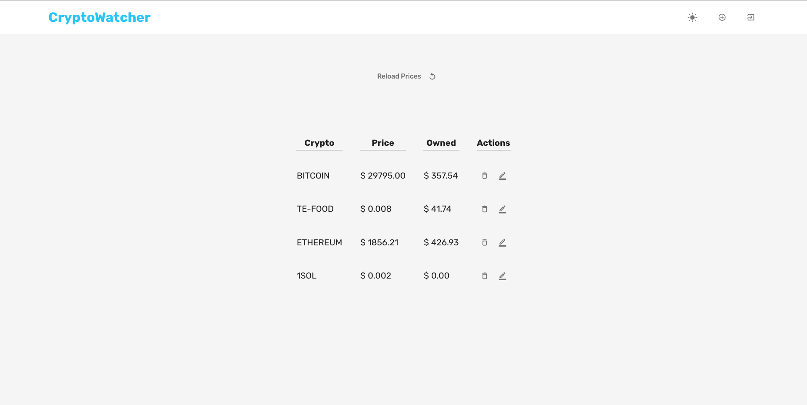
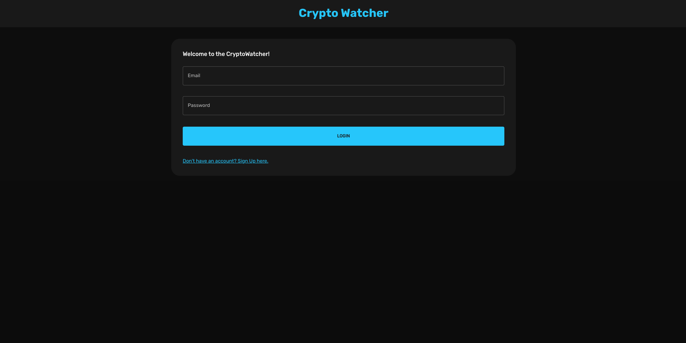

# Crypto Watcher
Crypto Price tracking Web App that
Consolidates all cryptocurrencies for easy viewing.


## About

Allows user to access real time database of all cryptos in the world.

User can add different cryptos to their unique profile.

Helps with tracking across different exchanges... Since not all exchanges list all cryptos.

Prices are an average across all exchanges if a crypto is in 2 or more exchanges.

### Pictures




## Built With

React.js (front end)
Express.js, Node.js (back end)
MongoDB (Database)

## How to Use

### To run to locally

Clone this repository.

Head into the client file and run

```npm install```

```npm start```

Open a new terminal and run 

```npm install```

```node server.js```


